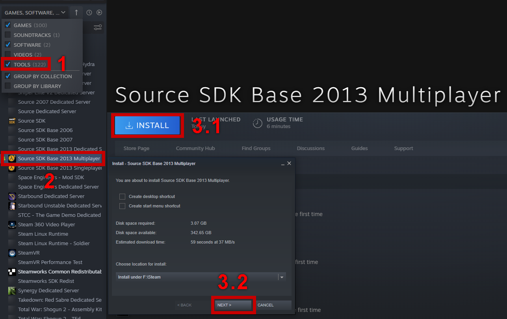
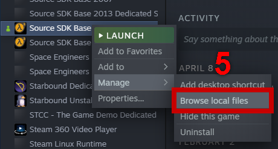
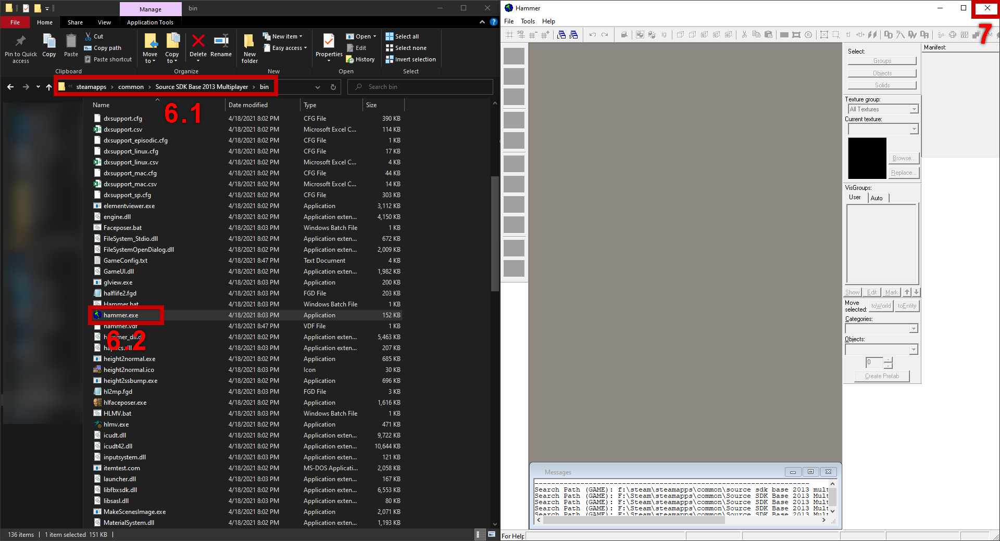
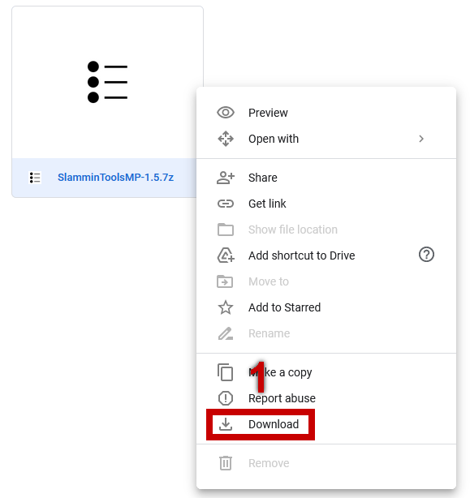
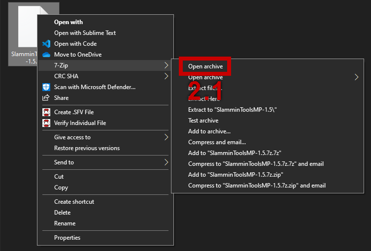
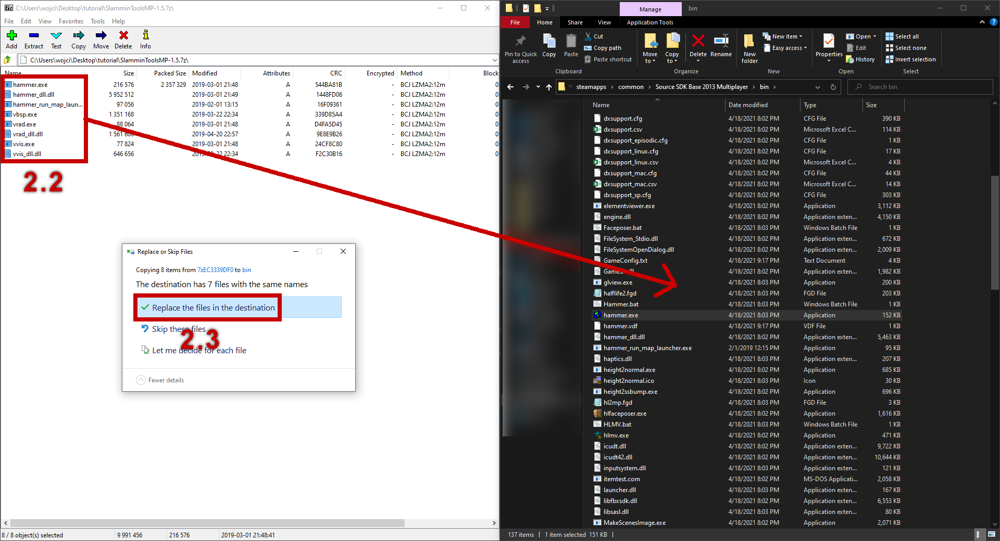
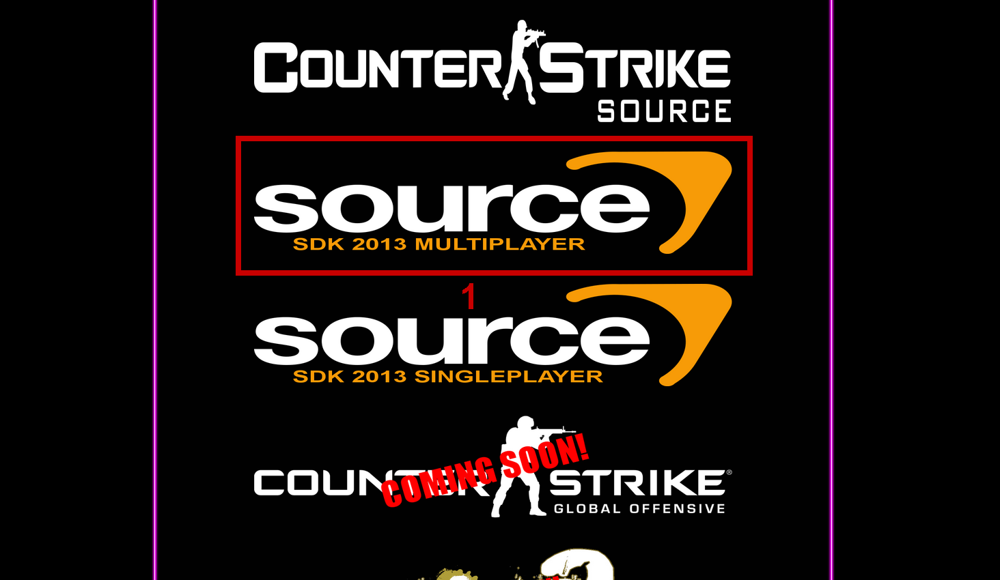
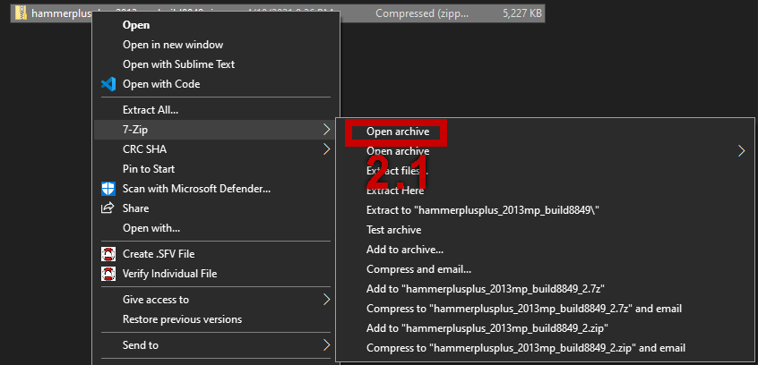
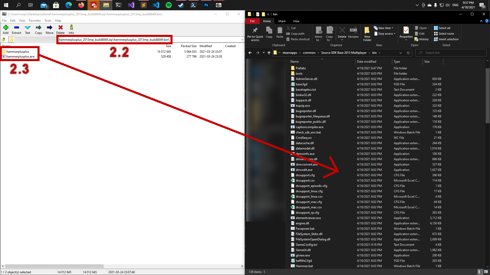

| Языки |
| --- |
| **en**, [ru](./lang/ru/) |

# Как использовать Hammer++ в Garry's Mod.

## Зачем я это создал?
Ответ довольно прост... Я ненавижу себя. Нет, но я действительно видел много людей, которые пытались установить Hammer++ и использовать его с Garry's Mod, так что это лишь способ, который я нашел, чтобы использовать его с Garry's Mod.

## Требования
- Компьютер под управлением Windows 10 или выше
- [7-Zip](https://www.7-zip.org/)
- [Garry's Mod](https://store.steampowered.com/app/4000/Garrys_Mod/)
- Игры Source
	- [Counter-Strike: Source](https://store.steampowered.com/app/240/CounterStrike_Source/)
	- [Half-Life 2](https://store.steampowered.com/app/220/HalfLife_2/)
	- [Half-Life 2: Deathmatch](https://store.steampowered.com/app/320/HalfLife_2_Deathmatch/)
	- [Half-Life 2: Episode One](https://store.steampowered.com/app/380/HalfLife_2_Episode_One/)
	- [Half-Life 2: Episode Two](https://store.steampowered.com/app/420/HalfLife_2_Episode_Two/)
	- [Half-Life 2: Lost Coast](https://store.steampowered.com/app/340/HalfLife_2_Lost_Coast/)
	- (необязательно) [ИНФРА](https://store.steampowered.com/app/251110/INFRA/)
- Source SDK 2013 Multiplayer
- (Опционально) [Slammin' Tools] (https://drive.google.com/drive/folders/17pQY8wDkednZi0kMZOSpAtNBNmFWm6GJ)
- [Hammer++](https://ficool2.github.io/HammerPlusPlus-Website/index.html)

## Как установить необходимое?
В этом руководстве я предположу, что у вас установлен Garry's Mod, а также все игры Source, о которые я упомянул, и 7-Zip.

### Как установить мультиплеер Source SDK 2013.
1. Перейдите в свою steam библиотеку и убедитесь, что в ваших фильтрах отмечены инструменты.
2. Откройте категорию `БЕЗ КАТЕГОРИИ` и найдите `Source SDK 2013 Multiplayer`.
3. Нажмите `УСТАНОВИТЬ`, а затем `ДАЛЕЕ` и подождите, пока он не загрузится.

4. **ВЫ ДОЛЖНЫ ЗАПУСТИТЬ HAMMER ОТ SOURCE SDK 2013 MULTIPLAYER ПЕРЕД ПРОДОЛЖЕНИЕМ** (Шаги ниже, эпилог, как это сделать)
5. Щелкните правой кнопкой мыши на `Source SDK 2013 Multiplayer` и наведите курсор на `Manage`, а затем щелкните на `Browse local files`.

6. Перейдите в папку `bin` и дважды щелкните по `hammer.exe`, появится небольшое окно, выберите `Half-Life 2`.
7. Когда молоток откроется и полностью запустится, закройте его.


### (Необязательно) Как установить Slammin' Tools?
**Slammin' Tools не являются необходимыми, но они полезны, особенно, если вы компилируете карты Statua.**

1. Перейдите по этой [ссылке](https://drive.google.com/drive/folders/17pQY8wDkednZi0kMZOSpAtNBNmFWm6GJ) и скачайте файл, заканчивающийся на `.7z`.

2. После загрузки откройте архив и перетащите файлы в `бин` папку `Источник SDK 2013 Multiplayer` (он спросит вас, если вы хотите переопределить некоторые файлы и вы должны нажать да).


3. Теперь повторите шаг `6` и `7` установки `Source SDK 2013 Multiplayer`.

## Установка и настройка Hammer++
Теперь без лишней ерунды, так как я уже ненавижу себя до такой степени, что бью себя по лицу, мы попадаем в грандиозный финал, который устанавливает и настраивает Hammer++.

### Установка
1. Перейдите по ссылке [https://ficool2.github.io/HammerPlusPlus-Website/pages/download.html] и скачайте версию для `Source SDK 2013 Multiplayer`.

2. После загрузки откройте архив и перейдите внутрь папки, а затем перетащите файлы в папку `bin` Мультиплеера `Source SDK 2013`.


3. Теперь повторите шаг `6` и `7` установки `Source SDK 2013 Multiplayer`.

### Настройка
Эта часть руководства будет только описана, так что внимательно прочтите ее, ведь каждый шаг, написанный здесь, очень важен.

1. Перейдите в корневую папку `Source SDK 2013 Multiplayer` и откройте папку с именем `hl2`.
2. Откройте `gameinfo.txt` с помощью редактора на ваш выбор.
3. Вы должны добавить эти строки в ваш `gameinfo.txt`, **Не забудьте изменить "Общую папку группы" на нужный путь**.
```
			// Game contents
			game				"<Steam's common folder>/Counter-Strike Source/cstrike/cstrike_pak.vpk"
			game				"<Steam's common folder>/Half-Life 2/episodic/ep1_pak.vpk"
			game				"<Steam's common folder>/Half-Life 2/ep2/ep2_pak.vpk"
			game				"<Steam's common folder>/Half-Life 2/lostcoast/lostcoast_pak.vpk"
			game				"<Steam's common folder>/Half-Life 2 Deathmatch/hl2mp/hl2mp_pak.vpk"
			game				"<Steam's common folder>/infra/infra/pak01.vpk"
			game				"<Steam's common folder>/GarrysMod/garrysmod/garrysmod.vpk"
```
Ты добавляешь их после этих строк:
```
			// Where the game's binaries are
			gamebin				hl2/bin
			platform			|all_source_engine_paths|platform
```
Эти строки монтируют содержимое исходных игр, список идет следующим образом.
- Counter-Strike:Source
- Half-Life 2: Episode One
- Half-Life 2: Episode Two
- Half-Life 2: Lost Coast
- Half-Life 2: Deathmatch
- Infra
- Garry's Mod

4. Теперь перейдите в корневую папку `Source SDK 2013 Multiplayer`, а затем в папку bin
5. Дважды щелкните `hammerplusplus.exe` и когда появится маленькое окно вы должны выбрать `Half-Life 2`. Да, вы не будете добавлять `Garry's Mod` в этот список.
6. Как только молоток будет открыт, вы должны открыть `Tools` вниз и оттуда выбрать `Options...`.
7. Появится новое окно, нажмите на `Game Configurations` и вы увидите маленькую кнопку `Add`, нажмите на нее.
8. Перейдите в корневую папку `Garry's Mod` и затем в папку `bin`, найдите там файл `garrysmod.fgd` и загрузите его.
9. Нажмите на вкладку `2D Views` и в разделе `Options` отметьте все в правой колонке.
10. Во вкладке `Build Programs` измените путь `Game executable` на `<путь к Garry's Mod>/hl2.exe`.
11. Во вкладке `Build Programs` измените путь `Maps Folder` на `<путь к Garry's Mod>/garrysmod/maps`.
12. В `Hammer++` отключите Anisotropic Filtering.

## Последние слова
Теперь вы готовы использовать Hammer++ и он должен работать. Единственная проблема заключается в том, что вам придется дважды подключать содержимое, так как Hammer++ пока не поддерживает способ подключения Garry's Mod. Так что если вы используете Hammer++, то вы должны быть знакомы с `mount.cfg` гмода, поскольку для подключения контента к Hammer++ вы должны подключать его в `gameinfo.txt`, который вы редактировали ранее, и добавить сразу же после тех строк, которые вы добавили раньше, `game "<путь к вашему контенту>"`. Если вы считаете, что я могу что-то улучшить, тогда напишите мне на github или вы можете упомянуть меня на дискорде (ParSec#4563) на сервере [Statua Mapping](https://discord.gg/3Uq4WKNRuF). Я рекомендую вам зайти и сказать "hello", там много людей которые могут вам помочь со многими вашими проблемами.

Теперь, если вы не возражаете, я выстрелю себе в лицо.
Ох и я не могу забыть о тебе CoolGuy за то, что ты каждый день задавал мне один и тот же вопрос, когда я сделаю это, и напоминал мне, насколько я дезорганизован.
